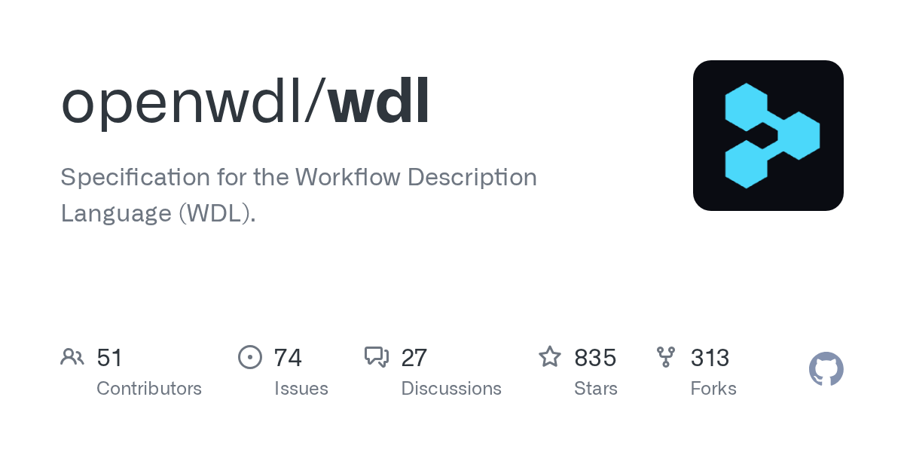

# Modular WDL pipeline for cell-free DNA methylation analysis.

## Background & Slide Deck

The work showcased:

**Slide Deck**
- [](slides/InfrastructurePresentation.pdf)
- [WDL Project](https://github.com/openwdl)

**Features**
- Parallelized WDL tasks for QC, mapping, and methylation calling
- Synthetic input data for demonstration
- Cromwell-compatible and containerized (Singularity)
- Designed for easy extension to other cfDNA or methylation datasets

**Overview**


**Quickstart**
```bash
cromwell run workflow/main.wdl --inputs config/inputs.json
```
